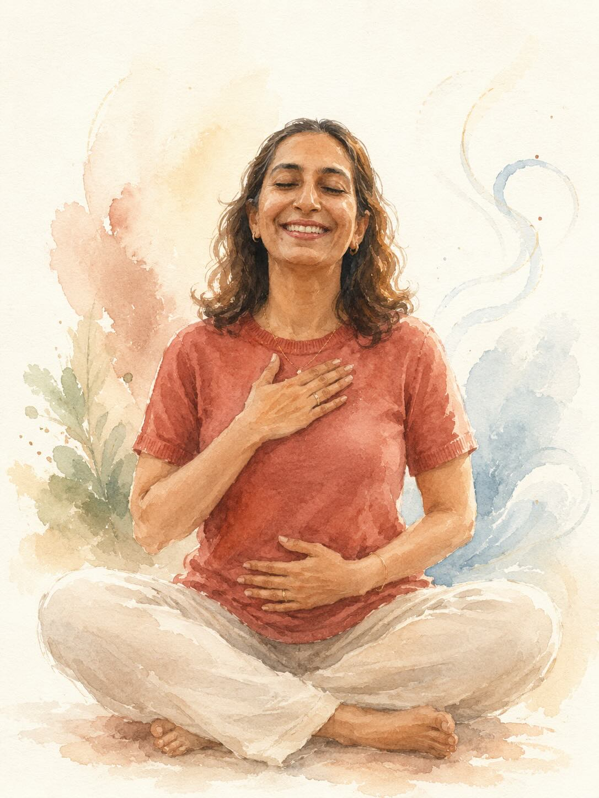

# Perimenopause Course — Project Handoff

> Paste this file into a new (local) Claude Code session to continue seamlessly.
> Repo: **sreebalakrishnan/sripriya.me** · Site: sripriya.me (static HTML/CSS/JS, no build step)

---

## 1. What this project is

Sripriya is a yoga teacher / image consultant near Auroville. We built a **7-day
perimenopause yoga course** as a web page on her site, matching the site's existing
watercolour-and-serif aesthetic (fonts: Cormorant Garamond + Inter; palette: terracotta
`#8B1A1A`, dusty blue `#8FAFC0`, cream `#FAF8F5`; full dark-mode support).

**Goal of the next session:** upload Sripriya's yoga photos, turn them into matching
watercolour illustrations (or use as-is), then **crop / resize / optimise / name** them
correctly and drop them into `assets/` so they appear in the already-built image slots.

---

## 2. Current status

| Item | State |
|------|-------|
| `perimenopause.html` — the 7-day course page | ✅ **Live on `main`** (PR #1, merged) |
| `index.html` — link to course from Yoga section | ✅ **Live on `main`** |
| Image slots (7 day images + 1 collage, with graceful fallback) | ⏳ On branch only — **PR #2 has a merge conflict, NOT yet on `main`** |
| The actual images | ❌ Not created yet |

### Git state
- Default branch: `main` (this is what deploys to the live site).
- Working branch: `claude/epic-hopper-83Tdc`.
- `main` HEAD: `f405724` — has the course page + link, **but no image slots**.
- Branch HEAD: `a04c13c` — has the course page + link + **image slots**.
- **PR #2** (`Add illustration slots…`) won't auto-merge: conflict because PR #1 was
  *squash-merged*, so the branch's base diverged from `main`.

### How to resolve PR #2 (do this early in the local session)
The branch's `perimenopause.html` is a strict superset of `main`'s (same file + the image
slots). Easiest fix — rebase the branch onto main, keeping the branch's version of the file:

```bash
git fetch origin
git checkout claude/epic-hopper-83Tdc
git rebase origin/main
# On conflict in perimenopause.html, keep the branch (slots) version:
git checkout --theirs perimenopause.html   # 'theirs' during rebase = our branch's content
git add perimenopause.html
git rebase --continue
git push --force-with-lease origin claude/epic-hopper-83Tdc
# PR #2 will then merge cleanly.
```
(Alternatively: skip PR #2 entirely and just commit the image-slot edits + the new images
directly in one fresh PR off `main`. The slot markup is described in §5.)

---

## 3. The 7-day course structure (already written on the page)

| Day | Theme | Pose/Scene focus | Image filename |
|-----|-------|------------------|----------------|
| 1 | Breathe · Meeting the Change (what perimenopause is) | Seated meditation, hands on heart/belly | `assets/peri-day1-breathe.jpg` |
| 2 | Move · Gentle Flow & Breath (45–50 min flow) | Warrior II | `assets/peri-day2-flow.jpg` |
| 3 | Nourish · Food as Medicine | Eating colourful local food | `assets/peri-day3-nourish.jpg` |
| 4 | Soothe · Mind, Mood & Affirmation | Hands at heart (Anjali mudra) | `assets/peri-day4-affirm.jpg` |
| 5 | Rest · Breath for Deep Sleep (15-min flow) | Legs-up-the-wall / reclining, crescent moon | `assets/peri-day5-rest.jpg` |
| 6 | Strengthen · Strength & Stability | Boat pose / strong standing | `assets/peri-day6-strength.jpg` |
| 7 | Carry forward · Your Daily Ritual | Walking outdoors, joyful | `assets/peri-day7-ritual.jpg` |
| — | Overview collage (optional hero) | All 7 vignettes in a grid | `assets/peri-hero-collage.jpg` |

Also on the page: a Food & Lifestyle reference grid, an affirmations collection, a medical
disclaimer, and a "book a session" CTA.

---

## 4. The images — plan & prompts

### Reference photos Sripriya already has (real)
- **Day 1** — riverside seated meditation (front-facing). *Also the best FACE reference for all days.*
- **Day 4** — kneeling in forest, prayer hands at heart (side profile).
- **Day 6** — V-balance / Boat pose holding toes (side profile).
- Bonus "wow" shot — forearm inversion against a tree → use for **collage / hero only**
  (too advanced for a gentle, all-levels day illustration).
- Still need scene refs for **Days 2, 3, 5, 7** → generate from prompts below.

### Art direction
Watercolour to match the existing site portrait (`assets/sripriya.jpg`). Keep all 7 in the
SAME style and SAME face. Tip: generate Day 1 first, then use that result as the character
reference for Days 2–7. Always attach the **front meditation photo** for face/jawline.

### Shared style block — prepend to EVERY prompt
> Soft, warm watercolour illustration, hand-painted look — loose expressive brushstrokes,
> visible paper texture, gentle washes. The same woman in every image: a South Asian / Indian
> woman in her late 40s, warm wavy shoulder-length chestnut-brown hair with sun highlights,
> defined jawline, warm brown eyes, soft natural smile (use the attached reference photo for
> her face and keep her jawline and likeness). Palette: cream / warm off-white background
> (#FAF8F5), deep terracotta-red (#8B1A1A) and soft dusty-blue (#8FAFC0) accents, ochre and
> sage tones. Airy, minimal composition, lots of negative space, no text or lettering,
> vertical 3:4 portrait.

### Per-day scenes (append to the style block)
- **Day 1 — Breathe:** seated cross-legged in easy pose, spine tall, eyes closed, one hand on
  heart and one on belly, faint breath-like swirls. Calm, grounded.
- **Day 2 — Flow:** standing on a mat in Warrior II (Virabhadrasana II), arms extended, strong
  yet graceful, dusty-blue and terracotta yoga clothes, gentle sense of motion.
- **Day 3 — Nourish:** seated at a simple wooden table eating from a bowl of colourful whole
  food — greens, papaya, pomegranate, seeds, glass of water; flaxseeds scattered. Warm, content.
- **Day 4 — Affirmation:** sitting peacefully by a sunlit window, hands pressed at the heart
  (Anjali mudra), eyes closed, soft warm glow, small bird/leaf motif. Tender, hopeful.
- **Day 5 — Rest:** lying back relaxed in legs-up-the-wall (Viparita Karani), eyes closed,
  evening palette, soft crescent moon and a few stars, cool dusty-blue washes. Restful, sleepy.
- **Day 6 — Strength:** strong and balanced — Boat pose (Navasana) OR Tree pose (Vrksasana),
  rooted, confident. Empowered.
- **Day 7 — Daily Ritual:** walking outdoors along a garden path in soft morning light,
  relaxed and joyful, gentle smile, greenery and flowers, a light shawl. Free, refreshed.
- **Collage / hero (landscape):** seven small watercolour vignettes of the same woman in a soft
  grid, one per day (breathing / Warrior II / eating / hands-at-heart / reclining with moon /
  Boat or Tree / walking), small hand-painted numerals 1–7, unified cream background.

---

## 5. How the image slots work (already in `perimenopause.html`)

**CSS** (in the `<style>` block):
```css
.day-illus { margin: 0 0 1.75rem; border-radius: 8px; overflow: hidden;
  border: 1px solid var(--rule); background: var(--blue-wash); }
.day-illus img { width: 100%; height: clamp(300px, 40vh, 460px);
  object-fit: cover; object-position: center; display: block; }
.day-collage { max-width: 920px; margin: 0 auto clamp(2rem, 4vw, 3rem);
  border-radius: 10px; overflow: hidden; border: 1px solid var(--rule);
  background: var(--blue-wash); }
.day-collage img { width: 100%; display: block; }
```

**Markup** — each day's left column (just above `<div class="block-label">Understand</div>`)
contains, e.g. for Day 1:
```html
<figure class="day-illus">
  
</figure>
```
The collage sits in the Overview section between the heading and the day-map grid
(`<figure class="day-collage">…</figure>`).

**Graceful fallback:** the `onerror` handler removes the frame if the image file is missing,
so the page looks clean now and each picture appears the moment its file is added to `assets/`.

---

## 6. Image specs for cropping/optimising (what to ask Claude to do locally)
- **Day images:** the slot crops to `height: clamp(300px,40vh,460px)` at full column width
  (~480–520px on desktop). So a **3:4 portrait ~900×1200px** works; centre the subject.
  If a head/feet get cropped, adjust `object-position` per image (e.g. `object-position: center 30%`).
- **Collage:** landscape, ~**1600×1000px**, shown up to 920px wide.
- **Format/weight:** save as `.jpg`, aim < ~300 KB each (the site is image-light and fast).
- Exact filenames: see the table in §3 — they're already referenced in the HTML.

### Good tasks for the local Claude session
1. Resolve PR #2 (see §2) — or open a fresh PR off `main`.
2. Take uploaded images → resize/compress/rename to the `assets/peri-*.jpg` names.
3. Tune `object-position` for any image whose crop clips the face/pose.
4. Optionally add the dramatic inversion photo to the hero or an "about the teacher" spot.
5. Commit + push, then merge to `main` to go live.

---

## 7. Key files
- `perimenopause.html` — the course page (self-contained: styles, markup, nav/footer JS).
- `index.html` — home page; course link is in the `#yoga` section.
- `assets/` — images live here (`sripriya.jpg` is the existing watercolour portrait).
- This handoff: `PERIMENOPAUSE-COURSE-HANDOFF.md`.

### Open PRs
- **#1** — Add 7-day perimenopause yoga course page — **MERGED**.
- **#2** — Add illustration slots — **OPEN, has merge conflict** (resolve per §2).
